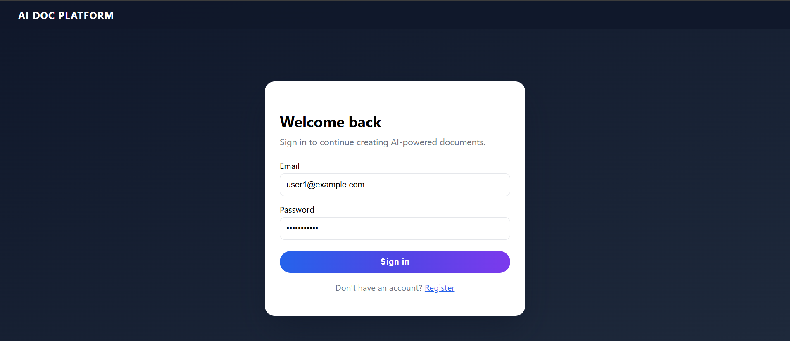
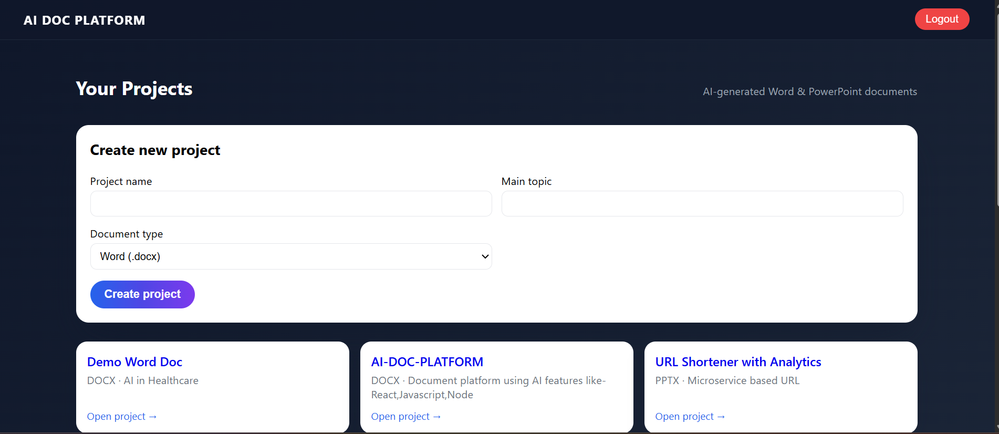
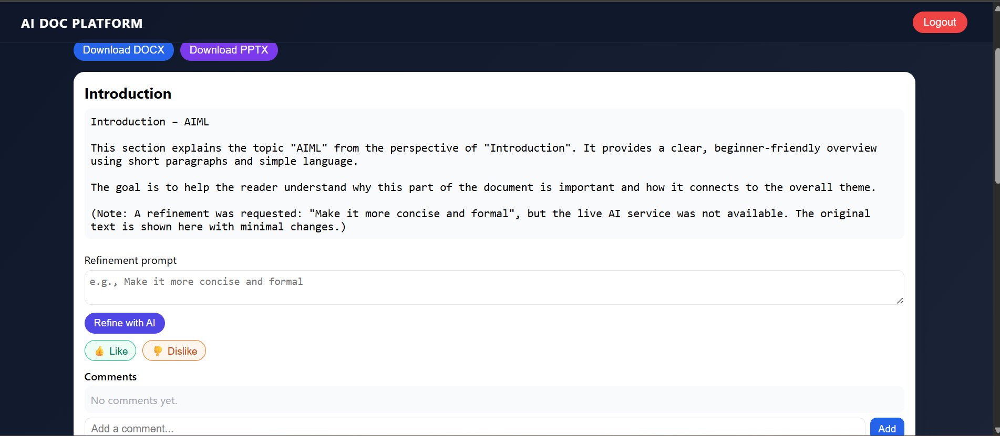
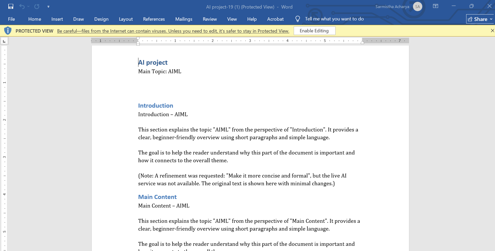

🚀 AI Doc Platform

AI-powered platform to generate, refine, and export professional Word (.docx) and PowerPoint (.pptx) documents using Gemini LLM, with a modern FastAPI backend and React frontend.
🌐 Live Demo Links
| Component                  Deployment URL                          |

Frontend (React) - Vercel -  <https://ai-doc-platform-deploy.vercel.app/> 

Backend (FastAPI) - Render - <https://ai-doc-platform-backend-deploy.onrender.com>

🎥 Demo Video
Demo Video: https://drive.google.com/file/d/1qcjZlD28wow2APe7kfGZ1CdGr9VRVE1G/view?usp=drive_link

🖼️ Screenshots
🔐 Login Page

📂 Projects Dashboard

 📝 Section Editor + Refinement

📤 Export Document

📘 Project Overview

This platform allows users to:

✅ Generate AI-powered documents

Auto-generate structured content for each section

Powered by Google Gemini API

Creates:

Word Document (.docx)

PowerPoint Presentation (.pptx)

✅ Refine text with instructions

Choose one of:

Make it formal

Make it simpler

Make concise

Rewrite for beginners

✅ Interact with each section

Like / Dislike

Comment

Edit / Regenerate

✅ Export final documents

DOCX export using python-docx

PPTX export using python-pptx

✅ Authentication & Database

JWT-based login

Postgres database (Render)

Stores projects, sections, comments, refinements

🏗️ Technologies Used
Backend – FastAPI

FastAPI

SQLAlchemy ORM

PostgreSQL

JWT Authentication

python-docx

python-pptx

Gemini 1.5 Flash API

Render Deployment

Frontend – React

ReactJS

Axios

React Router

Tailwind-style custom CSS

Deployed on Vercel

⚙️ Project Flow
1. User Registration & Login

Users register and login from the React frontend

Backend issues JWT tokens

Token is stored in localStorage

2. Creating a Project

User enters:

Project name

Main topic

Document type (DOCX / PPTX)

Backend automatically:

Creates project

Generates default sections

Uses Gemini LLM to generate first draft for each section

3. Refinement Workflow

User chooses refinement instruction → request goes to backend → Gemini rewrites text → updated text saved.

4. Feedback & Comments

Each section supports:

Like

Dislike

Comment (stored in DB)

5. Export

Final document is generated and downloaded as:

.docx powered by python-docx

.pptx powered by python-pptx

🛠️ Local Setup Instructions
Backend
cd backend
python -m venv venv
venv\Scripts\activate
pip install -r requirements.txt
uvicorn app.main:app --reload

Frontend
cd frontend
npm install
npm start

🚀 Deployment Overview
Backend (Render)

Deploy FastAPI using Docker or Build Command

Add environment variables

Expose port 8000

Connect to Render PostgreSQL

Frontend (Vercel)

Import GitHub repo

Set environment variable for backend URL

Automatic production deployment

🎯 Conclusion

This project fulfills all assignment requirements:
LLM-based generation
Refinement engine
Comments & feedback
Exporting DOCX/PPTX
React + FastAPI + Postgres full-stack system
Complete deployment
README + documentation + demo video support

